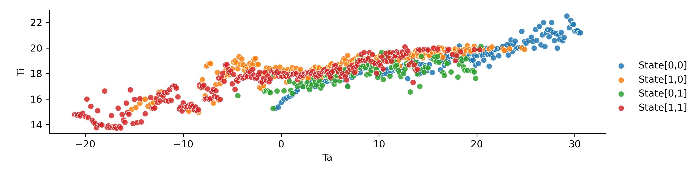

# Cold-Climate Heat Pump Master Equation

Master equations applied to thermal energy systems

The pathway for decarbonizing the thermal energy sector is challenging and will lean heavily on electric heat pump technologies. It is also founded on the need to to reduce carbon emissions, but does not grant consideration to economic or infrastructure limitations. An elegant solution to alleviate these barriers is to enable demand flexibility, often referred to as flexible load management (FLM). This is the process of providing energy consuming devices (loads) connected to the electric grid with the ability to respond in real-time to better manage regional demand for electricity. Heat pumps are a prime candidate for leveraging FLM to lower operational costs while mitigating the need for system upgrades. This paper proposes a thermal state model using differential master equations to understand the system dynamics and state equilibria under real-world conditions. This model provides a foundation for understanding state distributions to better assess FLM practices.

## INTRODUCTION
We are in a looming climate catastrophe.1 Rapidly electrifying how we condition our homes2 is required to displace significant amounts of greenhouse gas emissions. Consequently, this will grow demand on the electric grid that is highly correlated with extreme weather events. Flexibility can be used to reduce peak demand for electricity and provide valuable grid services. This can lead to a more efficient electric grid and allow for greater amounts of distributed renewable
energy to tie into the distribution and transmission systems. For the short term (5-10 years), many buildings that install heat
pumps will continue to jointly operate legacy fossil fueled thermal systems (boilers and furnaces) until these legacy systems reach their
end of life. Until the commercialization of phase-change thermal storage technologies, currently in pilot stage, households with dual-
fuel heating systems can leverage thermal storage capacity of the buildings’ envelope and the backup heating system. This approach
of providing temporary ( 50 hours per year) back-up heating will achieve greater grid flexibility during critical periods. This flexibility
has financial benefits that can reduce operating costs of heat pumps, which in turn will accelerate their deployment.
In regions like New England with access to natural gas, heat pumps have seen slower adoption due to operational economics.
In Burlington, natural gas is approximately 30 percent cheaper than electricity for heating.4 Leveraging commercially available
smart devices for heat pump FLM is a viable solution to enable faster heat pump deployment, but this has not been fully developed
commercially.

Research into the building energy space focusing on thermal flexibility is currently sparse. We propose a thermal state transition
model based on master equations to better understand the operational states of heat pumps and legacy fossil fueled systems within
a closed loop building envelope. This understanding sheds light on the potential for FLM across households and the benefit of building
weatherization to increase thermal resiliency.

## MODEL
Master Equations are a powerful tool for understanding the dynam-
ics of a system. Developing a thermal model with this foundation
has provided a better understanding for the distribution of electric-
ity use and the parameters that effect these distributions. This leads
us to ask - under what circumstances is flexible load management
possible?

The model used in this paper focuses on state transitions for a
dual-fueled heating system (electric heat pump and legacy fossil fuel
boiler) relative to the indoor air temperature (𝑇𝑖 ). Consideration is
given to the ambient outdoor air temperature (𝑇𝑎 ), which effects the
thermal loss of the building envelope and efficiency of the heating
systems. Heat pump technologies, though becoming increasingly
adept at handling colder temperatures, see considerable reductions
in performance as temperatures drop.
