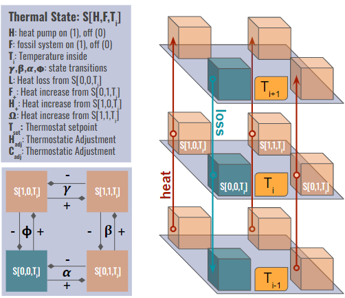
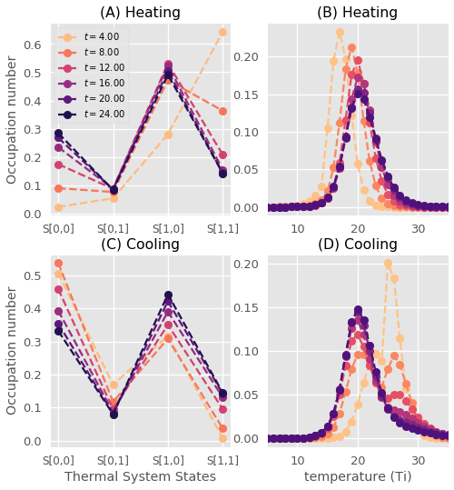
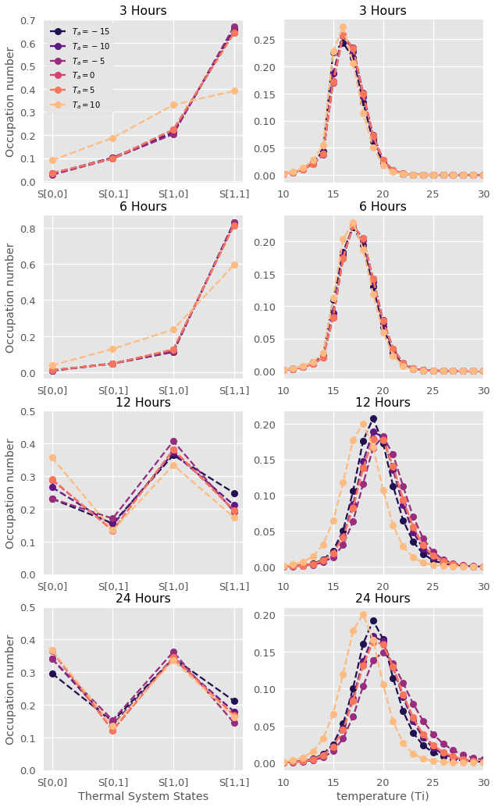

# Cold-Climate Heat Pump Master Equation

Master equations applied to thermal energy systems

The pathway for decarbonizing the thermal energy sector is challenging and will lean heavily on electric heat pump technologies. It is also founded on the need to to reduce carbon emissions, but does not grant consideration to economic or infrastructure limitations. An elegant solution to alleviate these barriers is to enable demand flexibility, often referred to as flexible load management (FLM). This is the process of providing energy consuming devices (loads) connected to the electric grid with the ability to respond in real-time to better manage regional demand for electricity. Heat pumps are a prime candidate for leveraging FLM to lower operational costs while mitigating the need for system upgrades. This paper proposes a thermal state model using differential master equations to understand the system dynamics and state equilibria under real-world conditions. This model provides a foundation for understanding state distributions to better assess FLM practices.

## 1. INTRODUCTION
We are in a looming climate catastrophe.1 Rapidly electrifying how we condition our homes2 is required to displace significant amounts of greenhouse gas emissions. Consequently, this will grow demand on the electric grid that is highly correlated with extreme weather events. Flexibility can be used to reduce peak demand for electricity and provide valuable grid services. This can lead to a more efficient electric grid and allow for greater amounts of distributed renewable
energy to tie into the distribution and transmission systems. For the short term (5-10 years), many buildings that install heat
pumps will continue to jointly operate legacy fossil fueled thermal systems (boilers and furnaces) until these legacy systems reach their
end of life. Until the commercialization of phase-change thermal storage technologies, currently in pilot stage, households with dual-
fuel heating systems can leverage thermal storage capacity of the buildings’ envelope and the backup heating system. This approach
of providing temporary ( 50 hours per year) back-up heating will achieve greater grid flexibility during critical periods. This flexibility
has financial benefits that can reduce operating costs of heat pumps, which in turn will accelerate their deployment.
In regions like New England with access to natural gas, heat pumps have seen slower adoption due to operational economics.
In Burlington, natural gas is approximately 30 percent cheaper than electricity for heating.4 Leveraging commercially available
smart devices for heat pump FLM is a viable solution to enable faster heat pump deployment, but this has not been fully developed
commercially.

Research into the building energy space focusing on thermal flexibility is currently sparse. We propose a thermal state transition
model based on master equations to better understand the operational states of heat pumps and legacy fossil fueled systems within
a closed loop building envelope. This understanding sheds light on the potential for FLM across households and the benefit of building
weatherization to increase thermal resiliency.

## 2. MODEL
Master Equations are a powerful tool for understanding the dynam-
ics of a system. Developing a thermal model with this foundation
has provided a better understanding for the distribution of electric-
ity use and the parameters that effect these distributions. This leads
us to ask - under what circumstances is flexible load management
possible?

The model used in this paper focuses on state transitions for a
dual-fueled heating system (electric heat pump and legacy fossil fuel
boiler) relative to the indoor air temperature (𝑇𝑖 ). Consideration is
given to the ambient outdoor air temperature (𝑇𝑎 ), which effects the
thermal loss of the building envelope and efficiency of the heating
systems. Heat pump technologies, though becoming increasingly
adept at handling colder temperatures, see considerable reductions
in performance as temperatures drop.

### 2.1 Master Equations
These four differential Master Equations allow us to track the distri-
bution of state probabilities through time and across temperature
(𝑇𝑖 and 𝑇𝑎 ). Figure 2 is a visual representation of these equations and
illustrates how states can transition by turning thermal systems on
and off, or transitioning between different indoor air temperature,
𝑇𝑖 . Additional equations, defined in 3.2 and 3.3, feed into and guide
the probabilities of state transitions.
The following four equations outline the thermal states $𝑆[𝐻,𝐹,𝑇_𝑖]$

State with nothing on:
S\_0,0,T_i =& S\_1,0,T_i\_-C\_adj + S\_0,1,T_i\_-C\_adj - S\_0,0,T_i(\_+ \_-)H\_adj - S\_0,0,T_iL + S\_0,0,T\_i+1L

State with HP on:
S\_1,0,T_i =& S\_0,0,T_i\_+H\_adj + S\_1,1,T_i\_-C\_adj - S\_1,0,T_i(\_-C\_adj & + \_+H\_adj) - S\_1,0,T_iF\_+ + S\_1,0,T\_i-1F\_+

State with Fossil on:
S\_0,1,T_i =& S\_1,1,T_i\_-C\_adj + S\_0,0,T_i\_+H\_adj - S\_0,1,T_i(\_+H\_adj & + \_-C\_adj) - S\_0,1,T_iH\_+ + S\_0,1,T\_i-1H\_+

State with both HP and Fossil on:
S\_1,1,T_i =& S\_1,0,T_iH\_adj + S\_0,1,T_i\_+H\_adj - S\_1,1,T_i(\_- & + \_-)C\_adj - S\_1,1,T_i+ S\_1,1,T\_i-1

### 2.2 Thermal Efficiency Equations
These equations outline the efficiency of the thermal envelope (𝐿)
as well as the ability of the thermal systems to generate heat (𝐻+, 𝐹+
and Ω). These equations are derived from literature and industry
knowledge when possible

### 2.3 Thermal Activation Functions
Thermostats operate to allow for heating (and cooling) to occur
within a range or band of temperatures above and below a desired
setpoint temperature, 𝑇𝑠𝑒𝑡 . These two functions generate probabil-
ities for a given state to alter their thermal system or remain the
same. Each uses a logistic function and are inverse probabilities.
Equilibrium occurs when a state is within the ideal range of a tem-
perature setpoint, and allows for slight probabilistic fluctuations to
occur above and below $𝑇_𝑠𝑒𝑡$.

### 2.4 Probability Transition Matrix
The initial state transition matrix is derived by taking occupancy
probabilities from the data for each state, holding 𝑇𝑖 constant. The
result represents the mean occupancy probability of a given state
across the sample. We can infer the transition probabilities with
the understanding that a state has two transition choices holding
𝑇𝑖 and 𝑇𝑎 constant. This is shown in Figure 2 in the bottom left
square. State [0, 0,𝑇𝑖 ] has two transition decisions and knowing the
occupancy probability informs the transition probability of moving
to state 𝑆 [1, 0,𝑇𝑖 ] or 𝑆 [0, 1,𝑇𝑖 ]. To determine each bi-directional
state transitions, weighted occupancy ratios were calculated leav-
ing a given state, each summing to one. The resulting probability
transition matrix, represented by 𝑆𝐻,𝐹 , is shown below.

We relax the assumption that 𝑇𝑎 is fixed and consider the prob-
ability transition matrix for a set of temperature bands. After dis-
cretizing the dataset into four temperature bins, we follow the same
approach as discussed above, and use the occupancy probabilities
shown in Figure 3. A probability transition matrix is calculated, as
demonstrated above, for each of the four 𝑇𝑎 bins.
Considering the occupancy matrix for a moment, we see some
trends that will be explored in more detail in the following sec-
tions. Perhaps the most surprising of these is the relative stability
of the fossil fuel only state, 𝑆 [0, 1,𝑇𝑖 ]. We see a small decline of
about 3 percent when temperatures move below −10◦𝐶. The heat
pump state, 𝑆 [1, 0,𝑇𝑖 ] shows similar consistency across tempera-
tures greater than −10◦𝐶, but sees a significant drop-off of about 10
percent at temperatures below this point. Some of this lost ground
is made up by the everything on state, 𝑆 [1, 1,𝑇𝑖 ]. Oddly, we see the
nothing on state dip in probability below 0◦𝐶, only to rebound to
a probability of 0.13. This is a slightly confusing occurrence that
should be explored in further detail.

## 3 SIMULATIONS
We use two simulation scenarios to test the functionality of the
master equations, the underlying parameters, and ultimately their
effect on state and temperature distributions through time and upon
reaching a steady state.

### 3.1 Time: 𝑡
In Figure 4 we hold𝑇𝑎 fixed at −10◦𝐶 and establish a desired setpoint
relative to a 𝑇𝑠𝑒𝑡 = 20◦𝐶. For the upper plots of this figure (A and B)
we set the starting internal temperature at 𝑇𝑖 = 15◦𝐶. This simulates
a building that is cooler than its desired setpoint and requests the
thermal systems to respond to reach the desired setpoint, 𝑇𝑠𝑒𝑡 =
20◦𝐶. For (C) and (D) we explore the opposite scenario with a
starting setpoint of 𝑇𝑖 = 25◦𝐶 to simulate an overheating event
where cooling is needed in the form of reducing fossil and heat
pump use and allowing the building to drift. The duration of these
scenarios is over the course of a 24-hour day, where 𝑡 is measured
in hourly increments. The initial state distribution is uniform across
all thermal system states, each corresponding to a value of 0.25.
For the heating scenario in Figure 4 (A and B) the first eight
hours show a much higher occupation number, indicating a high
probability of turning both heating systems on. Consequently, we
see temperature distribution quickly move from the starting value
of 15◦𝐶 to a mean of 𝑇𝑖 = 20◦𝐶 within these first eight hours. As
𝑡 > 8, we see the occupation probability decrease for 𝑆 [1, 1], and
increase in 𝑆 [0, 0]. This is an expected transition as 𝑇𝑖 approaches
𝑇𝑠𝑒𝑡 and the demand for heat is relaxed. Interestingly, the heat pump
and fossil systems remain relatively stable across this transition in
temperature (𝑇𝑖 ) through time.

In the bottom section of Figure4 (C and D) a much more stable
pattern is observed. In the early hours, the state occupation num-
bers put a lot of weight into 𝑆 [0, 0] with almost no probability of
occupying 𝑆 [1, 1]. When considering how the temperature distri-
bution is transitioning relative to these thermal systems, we see an
interesting bimodal distribution. One hypothesis is the structure of
the model, which requires S[1,1] to pass through S[0,1] or S[1,0]
in order to reach S[0,0], is the cause. This transition process may
be causing temporary occupation in these middle states where the
fossil or heat pump system is generating excess heat and increasing
𝑇𝑖 . Eventually, as 𝑡 > 12 we observe that 𝑇𝑖 returns to a normal
distribution centered on 20◦𝐶

### 3.2 Ambient Temperature: 𝑇𝑎
Here we use the same model as simulated in section 4.1, with a
few parameter adjustments. The first change made is to look at six
different values of ambient outdoor air temperature (𝑇𝑎 ) to see the
effect it has on the distribution of the thermal systems and internal
temperatures (𝑇𝑖 ). We revisit the thermal probability transition
matrix of 3.4 and update our transition parameters associated with
𝑇𝑎 . In order for us to see these effects through time, snapshots are
taken of the state distributions for the thermal systems (left column)
and 𝑇𝑖 (right column) in Figure 5 over a range of hourly values,
𝑡 = [3, 6, 12, 24]. In this simulation we only consider demand for
heating with the same starting setpoint and desired thermostat
setpoint of 𝑇𝑖 = 15◦𝐶 and 𝑇𝑎 = 20◦𝐶, respectively.

At the third hour (𝑡 = 3) we first see divergence occurring with
the probability distribution of 𝑇𝑎 = 10. This causes the 𝑇𝑖 distribu-
tion for that value of 𝑇𝑎 to be slightly behind the others in reaching
a steady state equilibrium around 20◦𝐶. This becomes more appar-
ent with higher values of 𝑡. The other states remain homogeneous
Figure 5: State and temperature (𝑇𝑖 ) distributions played out
over time (𝑡) and selected by ambient temperature (𝑇𝑎 ).
in their state distributions within these early hours. When reaching
𝑡 > 12 we begin to see divergence forming with the distribution for
𝑇𝑎 = −15◦𝐶 along with 𝑇𝑎 = 10◦𝐶. Both states appear to be further
away from reaching the equilibrium state than the progress being
made by more moderate temperatures.

Looking at the plots for 𝑡 = 24 within Figure 5 we see that the
coldest temperature simulation remains slightly behind the others
in reaching a steady state equilibrium for 𝑇𝑖 , while also seeing a
slightly higher occupation number for the state representing every-
thing both the heat pump and fossil fuel systems being turned on,
𝑆 [1, 1,𝑇𝑖 ]. We can expect that given this thermal system distribu-
tion, we will see this simulation joined by the other values of 𝑇𝑎 in
an equilibrium state centered on 𝑇𝑖 = 20◦𝐶.

The lag in reaching this equilibrium state for 𝑇𝑖 aligns with
intuition for the colder extreme simulation (𝑇𝑎 = −15◦𝐶), but is
less intuitive for the moderate temperature of 𝑇𝑎 = 10◦𝐶. One
interpretation of these results is to consider a possible slow-down
effect that occurs to avoid overshooting the desired setpoint, 𝑇𝑠𝑒𝑡
and the lack of thermal inertia that this state possesses relative to
other states

## 4 CONCLUSION
The models produced in this paper are a simplification of a complex
system that collides thermodynamics, human behavior, and eco-
nomics. With that said, the model produces results that are mostly
intuitive and support the underlying real-world data that went into
parameter tuning. We have seen that temperature, both internal
and external, has a dramatic effect on the state distributions of the
thermal systems.

Two additional takeaways are the occupation numbers for heat
pumps and fossil systems are consistent across values of 𝑇𝑎 and 𝑇𝑖 ,
and that heat pumps are approximately 2 to 5 times more likely to
be on alone than compared to a fossil system when in equilibrium.
This is of interest as we consider one of the motivations for studying
this system - to explore opportunities for flexible load management
(FLM). We can see from the simulations that once equilibrium is
reached, a heat pump has an occupation number of 0.35 to 0.5,
whereas the fossil fuel state S[0,1] ranges from 0.1 to 0.15.
In the short term, while homes maintain dual-fuel thermal sys-
tems, this model points at available capacity in the fossil system to
provide temporary back-up heating while the heat pump is idled
during a grid capacity event. The natural question is to wonder
about the carbon impact of this scenario. The current operations
indicate that fossil fuels are not being completely offset by heat
pumps. Summing the states that indicate fossil fuel use, S[0,1] and
S[1,1], demonstrate that a fossil system is running for approximately
30 percent of the time when in equilibrium. As the probability of
a peak event does not make up 30 percent of the winter hours,
this back of the envelope assessment points to net carbon savings
achievable in the short term.

Furthermore, the economics of operating a heat pump reflect
that it should not be run as aggressively for temperatures below a
particular setpoint relative to natural gas. This analysis considered
binary values to assess system operations. If a continuous operation
scale were considered, we would likely see lower heat pump output
as values for 𝑇𝑎 decline and the thermal load provided by fossil
fueled systems increases.

There is ample space for future work to push this model forward.
Incorporating building weatherization and the impact of novel
phase-change thermal storage technologies are natural extensions.
Both of these technologies are carbon free investments that will im-
prove flexible load management potential while providing increased
efficiency for heat pump systems. With such sparse amounts of
field data to tune these models, continued efforts to gather data
and embed them into these models will allow for improved insight.
Altogether, building science focused on deep carbon reductions is
an exciting field at a critical moment in time.

## 5 MODEL CARD
THE MODEL: Four differential master equations define the thermal
states of a building. We are considering a dual-fueled residential
buildings with an electric heat pump and fossil fueled system (boiler
or furnace). The transitions between these four thermal states de-
pend on properties of the two thermal systems, the desired indoor
air temperature of the house (𝑇𝑠𝑒𝑡), and the outdoor air temperature
(𝑇𝑎 ).

USES: This model is intended to be used as a stepping stone into
further research related to thermal modeling and the opportunity
for FLM. Data collected to tune model parameters is not representa-
tive of the average building and should be considered with caution

